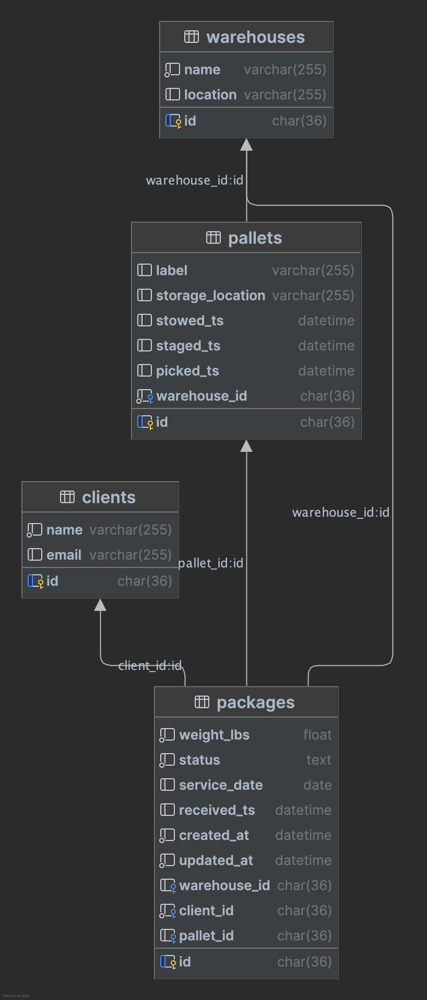

# Warehouse Management System (WMS) – GraphQL API

This project uses **Node.js**, **Apollo GraphQL**, and **SQLite** (via Knex.js query builder).

The system supports the following GraphQL mutations:

- **Induct:** [Register incoming packages.](./app/mutations/inductPackages.js)
- **Stow:** [Place packages onto pallets.](./app/mutations/stowPackages.js)
    - This mutation tries to group similar packages onto pallets based on their future `service_date`
    - I also assumed a max weight of 500 lbs allowed per pallet
    - If the mutation input provides a valid `pallet_id`, it will add packages onto the existing pallet before creating
      a new one

---

## Setup & Installation

1. **Install dependencies:**

   ```bash
   npm install
   ```

2. **Run the server:**

   ```bash
   npm start
   
   # or
   
   npm run dev # (watch mode)
   ```

3. **Run integration tests:**
   ```bash
   npm run test
   ```
   Example test run output:
    ```
    PASS  tests/induct-packages-mutation.test.js
      inductPackages Mutation
        ✓ successfully inducts multiple valid packages (20 ms)
        ✓ fails for package with wrong client_id (2 ms)
        ✓ fails for package not in PENDING status (2 ms)
        ✓ partial success: mix of valid and invalid packages (3 ms)
        
    PASS  tests/stow-packages-mutation.test.js
      stowPackages Mutation
        ✓ successfully stows multiple inducted packages (27 ms)
        ✓ fails for package not in INDUCTED status (4 ms)
        ✓ fails for package already on a pallet (5 ms)
        ✓ partial success: some valid, some invalid packages (3 ms)
        ✓ should stow heavy packages into multiple pallets grouped by service_date (7 ms)
        
    PASS  tests/seed-data-test-db.test.js
      Seed data
        ✓ assert test data was seeded correctly (19 ms)
    ```

## Architectural Overview

This is a diagram of the database schema in my application.



## State Transitions

**Note:** The assignment mentioned that package data is sent in advance, so I am calling this the `PENDING` state. I
assumed `PENDING` packages have the following initial data:

- `weight_lbs` (weight of the package)
- `service_date` (when the package needs to be
  delivered to its final destination)
- `client_id` (who does this package belong to)

#### PENDING --> INDUCTED:

Receive and register incoming packages into the system

| Field                   | Before Induction | After Induction                                      |
|-------------------------|------------------|------------------------------------------------------|
| `packages.status`       | `PENDING`        | `INDUCTED`                                           |
| `packages.warehouse_id` | `NULL`           | Set to the ID of the warehouse receiving the package |
| `packages.received_ts`  | `NULL`           | Timestamp when inducted                              |

#### INDUCTED --> STOWED:

Place packages on a pallet

| Field                  | Before Stowing | After Stowing                                                   |
|------------------------|----------------|-----------------------------------------------------------------|
| `packages.status`      | `INDUCTED`     | `STOWED`                                                        |
| `packages.pallet_id`   | `NULL`         | Set to the ID of the pallet the package was/will be placed onto |
|                        |                |                                                                 |
| `pallets.id`           |                | A generated ID identifying this pallet                          |               
| `pallets.warehouse_id` |                | The warehouse where the pallet was created                      |         
| `pallets.stowed_ts`    |                | Timestamp when stowed                                           |         

#### STOWED --> STAGED:

Place pallets into a staging location

| Field                      | Before Staging | After Staging                          |
|----------------------------|----------------|----------------------------------------|
| `packages.status`          | `STOWED`       | `STAGED`                               |
|                            |                |                                        |
| `pallets.staged_ts`        | `NULL`         | Timestamp when staged                  |
| `pallets.storage_location` | `NULL`         | Location identifier (e.g., `"Dock A"`) |

#### STAGED --> PICKED:

Retrieve pallets from staging location

| Field               | Before Picking | After Picking         |
|---------------------|----------------|-----------------------|
| `packages.status`   | `STAGED`       | `PICKED`              |
|                     |                |                       |
| `pallets.picked_ts` | `NULL`         | Timestamp when picked |

## Limitations of Current Design / Future Enhancements

#### Limitations/Assumptions of Current Technical Design

- There is no authentication. In a real world WMS, there would likely be auth credentials specific to each warehouse or
  even to individual operations within the warehouse.
- Clients can batch `package_ids` in a single request, but they are validated and inserted/updated in the database
  individually (not as batch db operations).
- This could be further optimized with a central event bus and queue -> consumer approach, where only initial
  validation
  is performed before an API response is returned to the client. Further processing could then be handled asynchronously
  by consumers, enabling better retriability, easier scalability, and more complex workflow orchestration.
- The mutations are not idempotent in all scenarios. Idempotency can be very helpful in situations where retries are
  needed or if operators accidentally submit operations more than once.
- I don’t consider warehouse operators in this design, but in a production system that would be important, especially if
  operators have different roles or permission levels.

#### Future Business Logic Enhancements

- Store package dimensions.
- Support different package types: `fragile`, `keep_frozen`, `normal`.
- Capture and store a photo of each package upon induction.
- Track which employee scanned each package (`packages.received_by`).
- Handle rejected packages with an exception workflow or allow retrying after additional information is provided.
- Implement an audit log to track all historical events for each package, especially if packages can skip steps or move
  backward in the workflow.
- Support reversing status transitions (e.g., `STAGED` -> `STOWED`).
- Automatically assign packages to existing pallets using an "optimal slotting strategy."

